# Resumate: Complete Architecture Deep Dive

**Living Document - Last Updated:** 2025-10-16
**Purpose:** Comprehensive map of entire codebase - every file, every connection, every data flow
**Usage:** Reference for architectural decisions, onboarding, refactoring, and maintaining holistic context

---

## Document Structure

This document is organized as an incremental exploration of the codebase:
1. Project Overview & Entry Points
2. Type System Flow (Source of Truth)
3. Core Rust Implementation
4. Frontend (Next.js App)
5. Utilities & Libraries
6. Scripts & Tooling
7. Configuration Files
8. Documentation System
9. Test Infrastructure
10. Data Flow Diagrams
11. Dead Code Audit
12. Final Mermaid Visualization

---

## Exploration Log

### Phase 1: Project Structure Overview

Analyzing file tree...

**Total Files:** 118
**Categories:** 
- Entry Points (pages, API routes): 10 files
- Type System (Rust → Schema → TS): 8 files  
- Core Rust (doc-gen workspace): 20 files
- Frontend Components: 13 files
- Libraries & Utilities: 10 files
- Scripts & Tooling: 13 files
- Tests: 16 files
- Configuration: 10 files
- Documentation: 18 files

---

### Phase 2: Type System - The Source of Truth

**Critical Concept:** The type system flows in ONE direction:
```
Rust Types (crates/shared-types/src/lib.rs)
  ↓ [generate_schema binary]
JSON Schema (schemas/resume.schema.json)
  ↓ [gen-ts-from-schemas.ts]
TypeScript Types (lib/types/generated-resume.ts)
  ↓ [re-exported]
Canonical Import (types/resume.ts)
```

Exploring type system files...

#### File: `crates/shared-types/src/lib.rs` (523 lines)
**Purpose:** SINGLE SOURCE OF TRUTH for all types in the project
**Exports:** Company, Position, Bullet, RoleProfile, ScoringWeights, ResumeData, PersonalInfo, Education
**Dependencies:** schemars (JSON Schema generation), serde (serialization)
**Key Concept:** Hierarchical structure: Company → Position → Bullet

**Type Hierarchy:**
```
ResumeData (root)
├── personal: PersonalInfo
├── summary: Option<String>
├── experience: Vec<Company>
│   └── Company
│       ├── id, name, location, dates, summary, description
│       ├── tags: Vec<String>, priority: u8 (1-10)
│       └── children: Vec<Position>
│           └── Position
│               ├── id, name, location, dates, summary, description
│               ├── tags: Vec<String>, priority: u8 (1-10)
│               └── children: Vec<Bullet>
│                   └── Bullet
│                       ├── id, name, location, dates, summary
│                       ├── description: String (the actual bullet text)
│                       ├── tags: Vec<String>, priority: u8 (1-10)
│                       └── link: Option<String>
├── education: Option<Vec<Education>>
├── skills: Option<HashMap<String, Vec<String>>>
└── role_profiles: Option<Vec<RoleProfile>>
    └── RoleProfile
        ├── id, name, description
        ├── tag_weights: HashMap<String, f32> (tag → relevance 0.0-1.0)
        └── scoring_weights: ScoringWeights
            ├── tag_relevance: f32 (weight 0.0-1.0)
            └── priority: f32 (weight 0.0-1.0, should sum to ~1.0)
```

**Validation Methods:**
- `Company::validate()`: Ensures ID, date_start, and at least one position
- `Position::validate()`: Ensures ID, name, date_start, at least one bullet
- `Bullet::validate()`: Ensures ID, description, priority in range 1-10
- `ScoringWeights::validate()`: Ensures non-negative, sums to ~1.0
- `ScoringWeights::normalize()`: Auto-normalizes weights to sum to 1.0
- `ResumeData::validate()`: Recursively validates entire structure

**Critical Design Decision:** All three levels (Company, Position, Bullet) share identical field names:
- id, name, location, date_start, date_end
- summary, description, tags, priority, link
- Only optionality varies (Company has optional name, Position/Bullet have required name)
- This consistency enables uniform traversal and processing

**Connections:**
- Used by: `generate_schema.rs` binary → generates JSON Schema
- Used by: All Rust code in doc-gen workspace (scoring, selection, PDF generation)
- Generated into: `schemas/resume.schema.json` → `lib/types/generated-resume.ts`


---

#### File: `crates/shared-types/src/bin/generate_schema.rs` (44 lines)
**Purpose:** Binary that generates JSON Schema from Rust types
**Inputs:** Rust types from `shared-types/src/lib.rs`
**Outputs:** `schemas/resume.schema.json`
**Key Function:** Uses `schemars::schema_for!(ResumeData)` to generate schema
**Execution:** `cargo run --bin generate_schema` or `just types-schema`
**Metadata:** Adds $comment with timestamp for auditability

**Critical Role:** This is the ONE place where Rust→JSON Schema conversion happens.
Any type changes MUST run this binary to regenerate the schema.

---

#### File: `doc-gen/crates/core/src/scoring.rs` (553 lines)
**Purpose:** Hierarchical bullet scoring algorithm
**Exports:** `score_bullet()`, `ScoredBullet`, calculation helpers
**Dependencies:** `shared-types` (Company, Position, Bullet, RoleProfile)
**Tests:** 14 unit tests + 8 property-based tests = 22 total

**Algorithm:**
```rust
final_score = base_score × company_multiplier × position_multiplier

where:
  base_score = (tag_relevance × tag_weight) + (priority/10 × priority_weight)
  company_multiplier = 0.8 + (company.priority / 10) × 0.4  // Range: 0.8-1.2
  position_multiplier = priority_mult × tag_mult  // Combined factors
```

**Key Functions:**
- `score_bullet(bullet, position, company, role_profile)` → f32: Main scoring
- `calculate_tag_relevance(tags, weights)` → f32: Average weight of matched tags
- `calculate_company_multiplier(company)` → f32: Maps priority 1-10 → 0.8-1.2
- `calculate_position_multiplier(position, tag_weights)` → f32: Priority + tags

**Design Decisions:**
- Tag matching is **case-sensitive** (intentional for precision)
- Unmatched tags contribute 0.0 (don't penalize, just don't boost)
- Multipliers are multiplicative (company prestige × position seniority × bullet score)
- Priority is normalized to 0.0-1.0 scale (divide by 10)

**Property-Based Tests (proptest):**
1. Score is always non-negative
2. Score is always finite (no NaN/inf)
3. Company multiplier in [0.8, 1.2]
4. Position multiplier in [0.7, 1.4]
5. Tag relevance in [0.0, 1.0]
6. Higher priority → higher score (monotonicity)
7. Scoring is deterministic (same input = same output)
8. Empty tags → zero tag relevance

**Connections:**
- Used by: `selector.rs` for bullet selection
- Used by: Integration tests in `tests/integration_test.rs`
- Used by: API route `/api/resume/select` (TypeScript reimplementation)

---

#### File: `doc-gen/crates/core/src/selector.rs` (419 lines)
**Purpose:** Bullet selection with diversity constraints
**Exports:** `select_bullets()`, `SelectionConfig`
**Dependencies:** `scoring.rs` (ScoredBullet, score_bullet)
**Tests:** 7 unit tests

**Algorithm:**
1. Extract all bullets from resume (Company → Position → Bullet traversal)
2. **Treat position descriptions as bullets** (if present)
3. Score each bullet using `score_bullet()`
4. Sort by score descending (best first)
5. Apply diversity constraints (greedy selection)

**SelectionConfig:**
```rust
pub struct SelectionConfig {
    pub max_bullets: usize,              // Default: 18
    pub max_per_company: Option<usize>,  // Default: Some(6)
    pub max_per_position: Option<usize>, // Default: Some(4)
}
```

**Key Functions:**
- `select_bullets(resume, role_profile, config)` → Vec<ScoredBullet>: Main entry point
- `score_description_as_bullet(position, company, role_profile)` → ScoredBullet: Convert position.description to bullet
- `apply_diversity_constraints(sorted, config)` → Vec<ScoredBullet>: Greedy selection with limits

**Critical Feature:** Position descriptions are treated as first-class bullets
- Synthetic bullet ID: `{position.id}-description`
- Uses position's tags and priority for scoring
- Competes with regular bullets in final selection

**Diversity Constraints:**
- **Total limit:** Stop at `max_bullets`
- **Per-company limit:** Max N bullets from any single company (prevents monopolization)
- **Per-position limit:** Max N bullets from any single role (ensures breadth)

**Selection Strategy:** Greedy best-first
- Not optimal (NP-hard problem), but fast and good enough
- Deterministic for given inputs (same resume + profile = same selection)

**Tests Validate:**
1. Basic selection respects max_bullets
2. Diversity constraints enforced per-company
3. Position descriptions included as bullets
4. Selection is deterministic (repeatability)
5. Sorted by score descending
6. Empty resume returns empty selection

**Connections:**
- Used by: Integration tests (`tests/integration_test.rs`)
- Used by: API route `/api/resume/select` (TypeScript reimplementation)
- Used by: WASM bindings (future work)


---

### Phase 3: Frontend & API Layer

#### File: `app/api/resume/select/route.ts` (370 lines)
**Purpose:** HTTP API endpoint for bullet selection (TypeScript reimplementation of Rust algorithm)
**HTTP Method:** POST
**Rate Limit:** 10 requests/hour per IP
**Authentication:** Cloudflare Turnstile (CAPTCHA)

**Request Body:**
```json
{
  "roleProfileId": "developer-relations-lead",
  "turnstileToken": "xxx",
  "config": {
    "maxBullets": 18,
    "maxPerCompany": 6,
    "maxPerPosition": 4
  }
}
```

**Response:**
```json
{
  "success": true,
  "roleProfile": { "id": "...", "name": "...", "description": "..." },
  "config": { "maxBullets": 18, ... },
  "selected": [
    {
      "bullet": { "id": "...", "description": "...", "tags": [...], "priority": 9 },
      "score": 1.23,
      "companyId": "...",
      "companyName": "...",
      "positionId": "...",
      "positionName": "..."
    }
  ],
  "count": 18,
  "timestamp": 1234567890
}
```

**Processing Flow:**
1. Rate limit check (IP-based, in-memory)
2. Turnstile CAPTCHA verification (skipped in dev mode)
3. Load resume data from `data/resume-data.json`
4. Find role profile by ID
5. Run bullet selection algorithm (TypeScript version)
6. Return scored bullets with metadata

**Algorithm Implementation:**
This is a **TypeScript reimplementation** of the Rust scoring/selection algorithm:
- `selectBullets()`: Main entry point, mirrors Rust `select_bullets()`
- `scoreBullet()`: Hierarchical scoring, mirrors Rust `score_bullet()`
- `calculateTagRelevance()`: Average weight of matched tags
- `calculateCompanyMultiplier()`: Maps priority 1-10 → 0.8-1.2
- `calculatePositionMultiplier()`: Priority + tag combo
- `applyDiversityConstraints()`: Greedy selection with limits

**Critical Notes:**
- **Phase 5.4+ will replace with WASM** for true Rust execution
- TypeScript version **must stay in sync** with Rust implementation
- Both versions tested to ensure parity (see tests/)

**Dependencies:**
- `@/lib/rate-limit`: IP-based rate limiting
- `@/types/resume`: Generated types from Rust
- `data/resume-data.json`: Loaded at build time

**Security Features:**
- Rate limiting (10 req/hour prevents abuse)
- Turnstile CAPTCHA (prevents bots)
- IP extraction from Cloudflare/Vercel headers
- No user data stored (stateless)

**Error Responses:**
- 400: Missing required fields
- 403: Turnstile verification failed
- 404: Role profile not found
- 429: Rate limit exceeded
- 500: Internal server error

**Tests:** `app/api/resume/select/__tests__/route.test.ts` (13 unit tests)

**Connections:**
- Called by: Frontend (future UI for resume generation)
- Uses: `lib/rate-limit.ts`, `types/resume.ts`, `data/resume-data.json`
- Mirrors: Rust implementation in `doc-gen/crates/core/src/{scoring,selector}.rs`

---

#### File: `scripts/gen-ts-from-schemas.ts` (61 lines)
**Purpose:** Generate TypeScript types from JSON Schema
**Input:** `schemas/resume.schema.json` (from Rust schema_emitter)
**Output:** `lib/types/generated-resume.ts`
**Library:** `json-schema-to-typescript`
**Execution:** `just types-ts` or `npx tsx scripts/gen-ts-from-schemas.ts`

**Process:**
1. Read JSON Schema from `schemas/resume.schema.json`
2. Compile to TypeScript using `json-schema-to-typescript`
3. Add banner comment warning not to edit manually
4. Apply style preferences (single quotes, no semicolons)
5. Write to `lib/types/generated-resume.ts`

**Banner Comment:**
```typescript
/**
 * Generated TypeScript types from Rust schemas
 * DO NOT EDIT MANUALLY - Generated via: just types-ts
 * Source: schemas/resume.schema.json
 */
```

**Configuration:**
- Single quotes: `singleQuote: true`
- No semicolons: `semi: false`
- Banner comment with generation metadata

**Critical Role:** This is step 2 of 3 in the type synchronization flow:
```
1. Rust types → JSON Schema (cargo run --bin generate_schema)
2. JSON Schema → TypeScript (just types-ts) ← THIS FILE
3. Re-export for app (types/resume.ts)
```

**Connections:**
- Depends on: `schemas/resume.schema.json` (from Rust)
- Generates: `lib/types/generated-resume.ts`
- Used by: `types/resume.ts` (re-exports)
- Triggers: `just types-ts` after schema changes


---

## Complete Data Flow Diagrams

### Flow 1: Type System (Source of Truth)

```
┌─────────────────────────────────────────────────────────────────┐
│ SINGLE SOURCE OF TRUTH                                          │
│ crates/shared-types/src/lib.rs                                  │
│ - Company, Position, Bullet, RoleProfile, ResumeData           │
│ - #[derive(JsonSchema)] for schema generation                  │
│ - Validation methods (validate(), normalize())                 │
└────────────────┬────────────────────────────────────────────────┘
                 │
                 │ cargo run --bin generate_schema
                 ↓
┌─────────────────────────────────────────────────────────────────┐
│ JSON SCHEMA                                                     │
│ schemas/resume.schema.json                                      │
│ - Generated JSON Schema with $comment metadata                 │
│ - Used for TypeScript generation                               │
└────────────────┬────────────────────────────────────────────────┘
                 │
                 │ just types-ts
                 ↓
┌─────────────────────────────────────────────────────────────────┐
│ GENERATED TYPESCRIPT TYPES                                      │
│ lib/types/generated-resume.ts                                   │
│ - AUTO-GENERATED (never edit manually)                         │
│ - Banner comment warns against manual edits                    │
└────────────────┬────────────────────────────────────────────────┘
                 │
                 │ import/re-export
                 ↓
┌─────────────────────────────────────────────────────────────────┐
│ CANONICAL IMPORT LOCATION                                       │
│ types/resume.ts                                                 │
│ - Re-exports from generated file                               │
│ - ALWAYS import from here in app code                          │
└─────────────────────────────────────────────────────────────────┘
                 │
                 │ imported by
                 ↓
       ┌─────────┴─────────┐
       │                   │
       ↓                   ↓
  App Components      API Routes
  - DataExplorer      - /api/resume/select
  - BulletCard        - /api/contact-card
  - CompanySection    - /api/resume/prepare
```

### Flow 2: Resume Data Lifecycle

```
┌─────────────────────────────────────────────────────────────────┐
│ GITHUB GIST (Source of Truth for Data)                         │
│ https://gist.githubusercontent.com/.../resume-data.json         │
│ - Public gist with resume data                                 │
│ - Manually edited by user                                      │
│ - Auto-triggers Vercel deploy via webhook                      │
└────────────────┬────────────────────────────────────────────────┘
                 │
                 │ just data-pull (or prebuild hook)
                 ↓
┌─────────────────────────────────────────────────────────────────┐
│ LOCAL DATA FILE                                                 │
│ data/resume-data.json                                           │
│ - Gitignored (not committed)                                   │
│ - Fetched from gist before build                               │
│ - Used at build time by Next.js                                │
└────────────────┬────────────────────────────────────────────────┘
                 │
                 │ Build time: Next.js static import
                 ↓
┌─────────────────────────────────────────────────────────────────┐
│ NEXT.JS BUILD ARTIFACTS                                         │
│ .next/static/chunks/[hash].js                                   │
│ - Resume data bundled into JavaScript                          │
│ - Served as static assets (fast CDN delivery)                  │
└────────────────┬────────────────────────────────────────────────┘
                 │
                 │ Runtime: Client-side or SSR
                 ↓
       ┌─────────┴─────────┐
       │                   │
       ↓                   ↓
  Pages/Routes         API Routes
  - /resume/view       - /api/resume/select
  - /resume            - /api/contact-card
```

### Flow 3: Bullet Scoring & Selection (Dual Implementation)

```
┌─────────────────────────────────────────────────────────────────┐
│ RUST IMPLEMENTATION (Source of Truth for Algorithm)            │
│ doc-gen/crates/core/src/                                        │
│ ├── scoring.rs: score_bullet(), calculate_*()                  │
│ └── selector.rs: select_bullets(), diversity constraints       │
│                                                                 │
│ - Property-based tests (proptest)                              │
│ - 236 Rust tests passing                                       │
└────────────────┬────────────────────────────────────────────────┘
                 │
                 │ Mirrored in TypeScript (Phase 5.4 will use WASM)
                 ↓
┌─────────────────────────────────────────────────────────────────┐
│ TYPESCRIPT IMPLEMENTATION (Temporary until WASM)                │
│ app/api/resume/select/route.ts                                  │
│ - scoreBullet(), selectBullets(), applyDiversityConstraints()  │
│ - Must stay in sync with Rust                                  │
│ - 13 unit tests to ensure parity                               │
└────────────────┬────────────────────────────────────────────────┘
                 │
                 │ HTTP POST /api/resume/select
                 ↓
┌─────────────────────────────────────────────────────────────────┐
│ API RESPONSE                                                    │
│ {                                                               │
│   "selected": [ScoredBullet],                                   │
│   "roleProfile": RoleProfile,                                   │
│   "config": SelectionConfig                                     │
│ }                                                               │
└────────────────┬────────────────────────────────────────────────┘
                 │
                 │ (Future: PDF/DOCX generation via WASM)
                 ↓
       ┌─────────┴─────────┐
       │                   │
       ↓                   ↓
  PDF Generation       DOCX Generation
  (WASM Future)        (WASM Future)
```

### Flow 4: Build & Deploy Pipeline

```
┌─────────────────────────────────────────────────────────────────┐
│ DEVELOPER COMMITS TO GITHUB                                     │
│ git push origin main                                            │
└────────────────┬────────────────────────────────────────────────┘
                 │
                 │ Webhook trigger
                 ↓
┌─────────────────────────────────────────────────────────────────┐
│ VERCEL BUILD                                                    │
│ 1. Install dependencies (bun install)                          │
│ 2. Prebuild: npm run prebuild                                  │
│    └─> scripts/fetch-gist-data.js --force                      │
│        └─> Downloads latest resume data from gist              │
│ 3. Build: just build                                        │
│    └─> Next.js production build                                │
│    └─> Bundles resume data into static chunks                  │
│ 4. Deploy to Vercel CDN                                        │
└────────────────┬────────────────────────────────────────────────┘
                 │
                 │ Deploy complete
                 ↓
┌─────────────────────────────────────────────────────────────────┐
│ PRODUCTION SITE                                                 │
│ https://resumate.vercel.app                                     │
│ - Static pages served from CDN                                 │
│ - API routes served from serverless functions                  │
│ - Resume data baked into build (no runtime fetch)              │
└─────────────────────────────────────────────────────────────────┘
```

### Flow 5: User Journey (Current State)

```
┌─────────────────────────────────────────────────────────────────┐
│ USER VISITS https://resumate.vercel.app                         │
└────────────────┬────────────────────────────────────────────────┘
                 │
                 ↓
┌─────────────────────────────────────────────────────────────────┐
│ LANDING PAGE (app/page.tsx)                                     │
│ - Hero section with tagline                                    │
│ - Links to /resume/view and contact card                       │
│ - Dark/light theme toggle                                      │
└────────────────┬────────────────────────────────────────────────┘
                 │
                 │ User clicks "View Resume"
                 ↓
┌─────────────────────────────────────────────────────────────────┐
│ RESUME VIEWER (app/resume/view/page.tsx)                        │
│ - DataExplorer component (interactive filtering)               │
│ - Search by text, filter by tags                               │
│ - Company timeline grouping                                    │
│ - Click tags to filter, view metrics                           │
│ - Download vCard (requires Turnstile CAPTCHA)                  │
└────────────────┬────────────────────────────────────────────────┘
                 │
                 │ User downloads vCard
                 ↓
┌─────────────────────────────────────────────────────────────────┐
│ CONTACT CARD DOWNLOAD (GET /api/contact-card)                   │
│ - Rate limited (10/hour per IP)                                │
│ - Turnstile CAPTCHA verification                               │
│ - Generates vCard 3.0 format                                   │
│ - Returns .vcf file for download                               │
│ - Email/phone from server-side env vars only                   │
└─────────────────────────────────────────────────────────────────┘
```

---

## Complete File Inventory (118 Files)

### 1. Configuration & Meta (10 files)
- `.claude/CLAUDE.md`: Claude Code context (modular docs)
- `.claude/settings.local.json`: Tool approval settings
- `.github/workflows/CLAUDE.md`: CI/CD context for AI
- `.vercel/project.json`: Vercel project config
- `Cargo.toml`: Rust workspace config (root)
- `package.json`: NPM scripts, dependencies
- `bun.lock`: NPM lockfile (auto-generated)
- `tsconfig.json`: TypeScript compiler config
- `next.config.ts`: Next.js configuration
- `vitest.config.ts`: Vitest test runner config

### 2. Documentation (18 files)
- `README.md`: Project overview, getting started
- `AGENTS.md`: AI agent patterns (claude-md-generator)
- `NAMING_CONVENTIONS.md`: Code style guide
- `CODE_REVIEW_GUIDE.md`: Review checklist for PR
- `SECURITY.md`: Security policy
- `docs/STATUS.md`: Current phase, progress
- `docs/TODOS.md`: Active tasks
- `docs/ARCHITECTURE.md`: System design overview
- `docs/ARCHITECTURE_DEEP_DIVE.md`: **THIS FILE**
- `docs/WORKFLOWS.md`: Development patterns
- `docs/DATA_SCHEMA.md`: Type system reference
- `docs/COMMANDS.md`: Command reference
- `docs/DEPLOYMENT.md`: Environment setup
- `docs/PHASE_5_PLAN.md`: Roadmap for Phase 5
- `docs/REFACTOR_SUMMARY.md`: Historical refactor notes
- `doc-gen/README.md`: Rust/WASM workspace readme
- `doc-gen/CLAUDE.md`: Rust-specific context
- `doc-gen/TEST_REPORT.md`: Comprehensive test metrics

### 3. Type System (8 files - THE CORE)
- `crates/shared-types/src/lib.rs`: **SOURCE OF TRUTH** - Rust types
- `crates/shared-types/src/bin/generate_schema.rs`: Rust → JSON Schema
- `crates/shared-types/Cargo.toml`: shared-types crate config
- `schemas/resume.schema.json`: Generated JSON Schema
- `lib/types/generated-resume.ts`: Generated TypeScript types
- `types/resume.ts`: **CANONICAL IMPORT** - Re-exports generated types
- `data/resume-data-template.json`: Template for new resumes
- `data/TEMPLATE_GUIDE.md`: Template documentation

### 4. Core Rust Implementation (20 files)
**doc-gen/crates/core/** (Scoring & Selection)
- `Cargo.toml`: Core crate config
- `src/lib.rs`: Module exports
- `src/types.rs`: Re-exports from shared-types
- `src/scoring.rs`: Hierarchical bullet scoring (553 lines, 22 tests)
- `src/selector.rs`: Bullet selection with diversity (419 lines, 7 tests)
- `tests/integration_test.rs`: Real data integration tests (753 lines, 15 tests)
- `tests/pdf_permutation.rs`: PDF permutation tests (733 lines, 7 tests)
- `tests/roundtrip.rs`: Serialization tests (12 tests)

**doc-gen/crates/pdf/** (PDF Generation)
- `Cargo.toml`: PDF crate config
- `src/lib.rs`: Main PDF generation API
- `src/generator.rs`: PDF document builder
- `src/layout.rs`: Layout engine (margins, spacing)
- `src/rendering/mod.rs`: Rendering module exports
- `src/rendering/header.rs`: PDF header rendering
- `src/rendering/footer.rs`: PDF footer rendering
- `src/rendering/experience.rs`: PDF experience/bullets rendering
- `tests/common/mod.rs`: Shared test utilities

**doc-gen/crates/docx/** (DOCX Generation - Placeholder)
- `Cargo.toml`: DOCX crate config
- `src/lib.rs`: DOCX generation API (basic structure)

**doc-gen/crates/wasm/** (WASM Bindings)
- `Cargo.toml`: WASM crate config
- `src/lib.rs`: wasm-bindgen exports (733 lines, 20 tests)

**doc-gen/pkg/** (Generated WASM artifacts)
- `docgen_wasm.js`: JavaScript bindings
- `docgen_wasm.d.ts`: TypeScript definitions
- `docgen_wasm_bg.wasm.d.ts`: WASM background types
- `package.json`: WASM package metadata

### 5. Next.js App (10 files)
**Pages:**
- `app/page.tsx`: Landing page
- `app/resume/page.tsx`: Resume redirect page
- `app/resume/view/page.tsx`: Main resume viewer (DataExplorer)
- `app/layout.tsx`: Root layout with theme provider
- `app/icon.tsx`: Favicon generator
- `app/robots.ts`: robots.txt generator
- `app/CLAUDE.md`: Next.js-specific context

**API Routes:**
- `app/api/contact-card/route.ts`: vCard download endpoint
- `app/api/resume/prepare/route.ts`: Resume preparation endpoint
- `app/api/resume/select/route.ts`: Bullet selection endpoint (370 lines)

### 6. Frontend Components (13 files)
**Data Components (Interactive Resume Viewer):**
- `components/data/DataExplorer.tsx`: Main interactive resume viewer
- `components/data/BulletCard.tsx`: Individual bullet display
- `components/data/CompanySection.tsx`: Company timeline grouping
- `components/data/SearchBar.tsx`: Text search input
- `components/data/TagFilter.tsx`: Tag filtering UI

**UI Components (Reusable):**
- `components/ui/Badge.tsx`: Tag badge component
- `components/ui/Button.tsx`: Button component
- `components/ui/ContactLinks.tsx`: Social media links
- `components/ui/GlassPanel.tsx`: Glassmorphism panel
- `components/ui/IconBadge.tsx`: Icon with badge
- `components/ui/Navbar.tsx`: Top navigation bar
- `components/ui/ThemeToggle.tsx`: Dark/light mode toggle

**Context:**
- `contexts/ThemeContext.tsx`: Theme state management

### 7. Utilities & Libraries (10 files)
- `lib/utils.ts`: General utilities (cn for classnames)
- `lib/tags.ts`: Tag processing and filtering
- `lib/resume-metrics.ts`: Resume metrics calculation
- `lib/vcard.ts`: vCard 3.0 generation (RFC-compliant)
- `lib/rate-limit.ts`: IP-based rate limiting (in-memory)
- `lib/README.md`: Library documentation
- `lib/__tests__/fixtures/resume-data.fixture.ts`: Test fixture data
- `lib/__tests__/README.md`: Test documentation
- `middleware.ts`: Next.js middleware (security headers, etc.)
- `next-env.d.ts`: Next.js TypeScript declarations

### 8. Scripts & Tooling (13 files)
- `scripts/gen-ts-from-schemas.ts`: JSON Schema → TypeScript
- `scripts/fetch-gist-data.js`: Gist → local (prebuild)
- `scripts/gist-push.js`: Local → gist (with conflict detection)
- `scripts/gist-view.js`: View gist in terminal
- `scripts/test-bullet-selection-api.ts`: API integration test
- `scripts/transform-resume-data.ts`: Data migration script
- `scripts/transform-template.ts`: Template transformation
- `scripts/clean-template.ts`: Template cleanup
- `scripts/validate-compendium.mjs`: Schema validation
- `scripts/CLAUDE.md`: Scripts-specific context
- `public/theme-init.js`: Client-side theme initialization (prevents flash)
- `postcss.config.mjs`: PostCSS configuration (Tailwind)
- `eslint.config.mjs`: ESLint configuration

### 9. Test Files (16 files)
**TypeScript Tests (125 tests total):**
- `app/api/resume/select/__tests__/route.test.ts`: API route tests (13)
- `components/data/__tests__/DataExplorer.test.tsx`: Component tests
- `components/data/__tests__/SearchBar.test.tsx`: Search tests
- `components/data/__tests__/TagFilter.test.tsx`: Filter tests
- `lib/__tests__/tags.test.ts`: Tag utility tests
- `lib/__tests__/vcard.test.ts`: vCard generation tests (34)
- `lib/__tests__/rate-limit.test.ts`: Rate limiting tests (30)
- `vitest.setup.ts`: Vitest global setup

**Rust Tests (236 tests total):**
- `crates/shared-types/tests/real_data.rs`: Real data validation (8)
- `crates/shared-types/tests/roundtrip.rs`: Serialization (12)
- `crates/shared-types/tests/schema_validation.rs`: Schema tests (11)
- `doc-gen/crates/core/tests/integration_test.rs`: Integration (15)
- `doc-gen/crates/core/tests/pdf_permutation.rs`: Permutation (7)
- `doc-gen/crates/core/tests/roundtrip.rs`: Roundtrip (12)
- `doc-gen/crates/core/src/scoring.rs`: Contains 22 inline tests
- `doc-gen/crates/core/src/selector.rs`: Contains 7 inline tests
- `doc-gen/crates/wasm/src/lib.rs`: Contains 20 inline tests
- `doc-gen/crates/pdf/src/lib.rs`: Contains PDF generation tests

### 10. Data Files (2 files)
- `data/resume-data.json`: Actual resume data (gitignored, from gist)
- `data/resume-data-template.json`: Template structure

---

## Dead Code Audit

### Files Marked for Removal (None)
✅ All files serve active purposes in the current system.

### Files Pending Future Work
These files exist but have minimal implementation (placeholders for Phase 5):
1. `doc-gen/crates/docx/src/lib.rs`: Basic DOCX structure, awaiting Phase 5.5
2. `app/api/resume/prepare/route.ts`: Placeholder for future PDF/DOCX generation endpoint

### Redundant Patterns (None Critical)
- TypeScript scoring/selection in `app/api/resume/select/route.ts` duplicates Rust implementation
  - **Intentional**: Temporary until WASM integration (Phase 5.6)
  - **Mitigation**: Tests ensure parity between implementations

### Generated Files (Never Edit Manually)
⚠️ **AUTO-GENERATED - Do not modify:**
1. `lib/types/generated-resume.ts`: From JSON Schema
2. `schemas/resume.schema.json`: From Rust types
3. `bun.lock`: From npm
4. `Cargo.lock`: From cargo
5. `doc-gen/pkg/*`: From wasm-pack build

### Deprecated Files (None in current tree)
- `app/globals.css.backup`: Deleted in this PR


---

## Final Comprehensive Mermaid Diagram

This diagram shows the complete system architecture with all major components and their connections.
View at full size for best clarity (pan and zoom as needed).

```mermaid
graph TB
    %% =============================================================================
    %% EXTERNAL SYSTEMS
    %% =============================================================================
    
    subgraph EXTERNAL["🌍 External Systems"]
        GIST["📦 GitHub Gist<br/>resume-data.json<br/>(Source of Truth)"]
        VERCEL["☁️ Vercel Platform<br/>Build & Deploy<br/>CDN Distribution"]
        USER["👤 User Browser<br/>Web Client"]
        TURNSTILE["🔒 Cloudflare Turnstile<br/>CAPTCHA Verification"]
    end

    %% =============================================================================
    %% TYPE SYSTEM (CORE - SOURCE OF TRUTH)
    %% =============================================================================
    
    subgraph TYPES["🦀 Type System (Single Source of Truth)"]
        direction TB
        RUST_TYPES["<b>shared-types/src/lib.rs</b><br/>━━━━━━━━━━━━<br/>Rust Type Definitions<br/>• Company, Position, Bullet<br/>• RoleProfile, ScoringWeights<br/>• ResumeData, PersonalInfo<br/>• #[derive(JsonSchema)]<br/>• Validation methods"]
        
        SCHEMA_GEN["<b>generate_schema.rs</b><br/>━━━━━━━━━━━━<br/>Schema Generator Binary<br/>• Uses schemars<br/>• cargo run --bin"]
        
        JSON_SCHEMA["<b>schemas/resume.schema.json</b><br/>━━━━━━━━━━━━<br/>Generated JSON Schema<br/>• $comment with timestamp<br/>• Used for TS generation"]
        
        TS_GEN["<b>gen-ts-from-schemas.ts</b><br/>━━━━━━━━━━━━<br/>TypeScript Generator<br/>• json-schema-to-typescript<br/>• just types-ts"]
        
        GEN_TS["<b>lib/types/generated-resume.ts</b><br/>━━━━━━━━━━━━<br/>Generated TypeScript<br/>• AUTO-GENERATED<br/>• Never edit manually"]
        
        CANON_TS["<b>types/resume.ts</b><br/>━━━━━━━━━━━━<br/>Canonical Import Location<br/>• Re-exports generated types<br/>• ALWAYS import from here"]
        
        RUST_TYPES --> SCHEMA_GEN
        SCHEMA_GEN --> JSON_SCHEMA
        JSON_SCHEMA --> TS_GEN
        TS_GEN --> GEN_TS
        GEN_TS --> CANON_TS
    end

    %% =============================================================================
    %% CORE RUST IMPLEMENTATION
    %% =============================================================================
    
    subgraph RUST_CORE["🦀 Rust Core (Algorithm Implementation)"]
        direction TB
        
        subgraph SCORING["Scoring Module (scoring.rs)"]
            SCORE_BULLET["score_bullet()<br/>━━━━━━━━━━━━<br/>Hierarchical Scoring<br/>base × company × position"]
            CALC_TAG["calculate_tag_relevance()<br/>Average matched tag weights"]
            CALC_COMPANY["calculate_company_multiplier()<br/>Priority 1-10 → 0.8-1.2"]
            CALC_POSITION["calculate_position_multiplier()<br/>Priority + tag combo"]
            
            SCORE_BULLET --> CALC_TAG
            SCORE_BULLET --> CALC_COMPANY
            SCORE_BULLET --> CALC_POSITION
        end
        
        subgraph SELECTOR["Selector Module (selector.rs)"]
            SELECT["select_bullets()<br/>━━━━━━━━━━━━<br/>Main Selection<br/>Score → Sort → Constrain"]
            EXTRACT["extract_all_bullets()<br/>Flatten hierarchy"]
            DIVERSITY["apply_diversity_constraints()<br/>Greedy selection with limits"]
            
            SELECT --> EXTRACT
            SELECT --> DIVERSITY
        end
        
        subgraph PDF_GEN["PDF Generation (pdf/)"]
            GEN_PDF["generate_pdf()<br/>━━━━━━━━━━━━<br/>PDF Document Builder"]
            LAYOUT["Layout Engine<br/>Margins, spacing, wrapping"]
            HEADER_RENDER["Header Rendering<br/>Name, contact info"]
            BODY_RENDER["Body Rendering<br/>Experience bullets"]
            FOOTER_RENDER["Footer Rendering<br/>Skills, education"]
            
            GEN_PDF --> LAYOUT
            GEN_PDF --> HEADER_RENDER
            GEN_PDF --> BODY_RENDER
            GEN_PDF --> FOOTER_RENDER
        end
        
        subgraph WASM_MOD["WASM Module (wasm/)"]
            WASM_EXPORTS["wasm_bindgen exports<br/>━━━━━━━━━━━━<br/>• generate_pdf()<br/>• generate_docx()<br/>• validate_payload()"]
        end
        
        RUST_TYPES -.-> SCORING
        RUST_TYPES -.-> SELECTOR
        RUST_TYPES -.-> PDF_GEN
        SCORING --> SELECTOR
        SELECTOR --> PDF_GEN
        PDF_GEN --> WASM_EXPORTS
    end

    %% =============================================================================
    %% NEXT.JS APPLICATION
    %% =============================================================================
    
    subgraph NEXTJS["⚛️ Next.js Application"]
        direction TB
        
        subgraph PAGES["Pages & Routes"]
            LANDING["app/page.tsx<br/>━━━━━━━━━━━━<br/>Landing Page<br/>Hero + Links"]
            VIEWER["app/resume/view/page.tsx<br/>━━━━━━━━━━━━<br/>Resume Viewer<br/>Interactive DataExplorer"]
        end
        
        subgraph API["API Routes"]
            API_SELECT["POST /api/resume/select<br/>━━━━━━━━━━━━<br/>Bullet Selection Endpoint<br/>• Rate limit: 10/hour<br/>• Turnstile verification<br/>• TypeScript implementation<br/>(mirrors Rust algorithm)"]
            
            API_CONTACT["GET /api/contact-card<br/>━━━━━━━━━━━━<br/>vCard Download<br/>• Rate limit: 10/hour<br/>• Turnstile verification<br/>• vCard 3.0 generation"]
            
            API_PREPARE["POST /api/resume/prepare<br/>━━━━━━━━━━━━<br/>PDF/DOCX Generation<br/>(Future: WASM integration)"]
        end
        
        subgraph COMPONENTS["Components"]
            DATA_EXPLORER["DataExplorer.tsx<br/>━━━━━━━━━━━━<br/>Main Resume Viewer<br/>• Search & filter<br/>• Tag filtering<br/>• Interactive UI"]
            
            BULLET_CARD["BulletCard.tsx<br/>Individual bullet display"]
            COMPANY_SEC["CompanySection.tsx<br/>Company timeline grouping"]
            TAG_FILTER["TagFilter.tsx<br/>Tag filtering UI"]
            SEARCH_BAR["SearchBar.tsx<br/>Text search input"]
        end
        
        subgraph LIBS["Libraries & Utilities"]
            RATE_LIMIT["rate-limit.ts<br/>━━━━━━━━━━━━<br/>In-memory rate limiting<br/>IP-based tracking"]
            
            VCARD_LIB["vcard.ts<br/>━━━━━━━━━━━━<br/>vCard 3.0 Generation<br/>RFC-compliant"]
            
            TAGS_LIB["tags.ts<br/>Tag processing & filtering"]
            METRICS_LIB["resume-metrics.ts<br/>Metrics calculation"]
        end
        
        CANON_TS --> API_SELECT
        CANON_TS --> API_CONTACT
        CANON_TS --> DATA_EXPLORER
        
        LANDING --> VIEWER
        VIEWER --> DATA_EXPLORER
        DATA_EXPLORER --> BULLET_CARD
        DATA_EXPLORER --> COMPANY_SEC
        DATA_EXPLORER --> TAG_FILTER
        DATA_EXPLORER --> SEARCH_BAR
        
        API_SELECT --> RATE_LIMIT
        API_CONTACT --> RATE_LIMIT
        API_CONTACT --> VCARD_LIB
        DATA_EXPLORER --> TAGS_LIB
        DATA_EXPLORER --> METRICS_LIB
    end

    %% =============================================================================
    %% SCRIPTS & TOOLING
    %% =============================================================================
    
    subgraph SCRIPTS["🔧 Scripts & Tooling"]
        direction TB
        
        FETCH_SCRIPT["fetch-gist-data.js<br/>━━━━━━━━━━━━<br/>Gist → Local<br/>just data-pull"]
        PUSH_SCRIPT["gist-push.js<br/>━━━━━━━━━━━━<br/>Local → Gist<br/>just data-push"]
        VIEW_SCRIPT["gist-view.js<br/>View gist in terminal"]
    end

    %% =============================================================================
    %% DATA STORAGE
    %% =============================================================================
    
    subgraph DATA["💾 Data Storage"]
        LOCAL_DATA["data/resume-data.json<br/>━━━━━━━━━━━━<br/>Local Resume Data<br/>• Gitignored<br/>• Fetched from gist<br/>• Used at build time"]
        
        TEMPLATE["data/resume-data-template.json<br/>━━━━━━━━━━━━<br/>Template Structure<br/>Example format"]
    end

    %% =============================================================================
    %% TESTING INFRASTRUCTURE
    %% =============================================================================
    
    subgraph TESTS["🧪 Testing (361 Total)"]
        direction TB
        
        subgraph RUST_TESTS["Rust Tests (236)"]
            UNIT_TESTS["Unit Tests<br/>• scoring.rs: 22 tests<br/>• selector.rs: 7 tests<br/>• wasm: 20 tests"]
            INTEGRATION["Integration Tests<br/>• integration_test.rs: 15<br/>• pdf_permutation.rs: 7<br/>• Real data validation"]
            PROP_TESTS["Property-Based Tests<br/>• proptest framework<br/>• 8 invariant tests"]
        end
        
        subgraph TS_TESTS["TypeScript Tests (125)"]
            API_TESTS["API Route Tests<br/>route.test.ts: 13 tests"]
            UTIL_TESTS["Utility Tests<br/>• vcard: 34 tests<br/>• rate-limit: 30 tests"]
            COMP_TESTS["Component Tests<br/>DataExplorer, TagFilter"]
        end
    end

    %% =============================================================================
    %% CONNECTIONS BETWEEN MAJOR SYSTEMS
    %% =============================================================================
    
    %% External to Internal
    GIST -->|just data-pull| FETCH_SCRIPT
    FETCH_SCRIPT -->|Writes| LOCAL_DATA
    LOCAL_DATA -->|Build time import| NEXTJS
    PUSH_SCRIPT -->|just data-push| GIST
    
    %% Vercel Build Pipeline
    VERCEL -->|Prebuild: fetch gist| FETCH_SCRIPT
    VERCEL -->|Build Next.js app| NEXTJS
    NEXTJS -->|Deploy| VERCEL
    
    %% User Interactions
    USER -->|Visits site| VERCEL
    VERCEL -->|Serves| LANDING
    USER -->|Clicks vCard| API_CONTACT
    API_CONTACT -->|Verify| TURNSTILE
    USER -->|Future: Generate resume| API_PREPARE
    API_PREPARE -.->|Future| WASM_EXPORTS
    
    %% Type Flow
    RUST_TYPES -.->|Defines types for| RUST_CORE
    
    %% Algorithm Mirroring
    SCORING -.->|Mirrored in TS| API_SELECT
    SELECTOR -.->|Mirrored in TS| API_SELECT
    
    %% Testing Connections
    RUST_TESTS -.->|Validates| RUST_CORE
    TS_TESTS -.->|Validates| NEXTJS
    PROP_TESTS -.->|Validates| SCORING
    API_TESTS -.->|Ensures parity| API_SELECT

    %% =============================================================================
    %% STYLING
    %% =============================================================================
    
    classDef external fill:#e1f5ff,stroke:#0066cc,stroke-width:3px
    classDef types fill:#ffe1f5,stroke:#cc0066,stroke-width:3px
    classDef rust fill:#ffebe1,stroke:#cc3300,stroke-width:2px
    classDef nextjs fill:#e1ffe5,stroke:#00cc33,stroke-width:2px
    classDef scripts fill:#fff5e1,stroke:#cc9900,stroke-width:2px
    classDef data fill:#f0e1ff,stroke:#6600cc,stroke-width:2px
    classDef tests fill:#ffe1e1,stroke:#cc0000,stroke-width:2px
    
    class GIST,VERCEL,USER,TURNSTILE external
    class RUST_TYPES,SCHEMA_GEN,JSON_SCHEMA,TS_GEN,GEN_TS,CANON_TS types
    class SCORE_BULLET,CALC_TAG,CALC_COMPANY,CALC_POSITION,SELECT,EXTRACT,DIVERSITY,GEN_PDF,LAYOUT,HEADER_RENDER,BODY_RENDER,FOOTER_RENDER,WASM_EXPORTS rust
    class LANDING,VIEWER,API_SELECT,API_CONTACT,API_PREPARE,DATA_EXPLORER,BULLET_CARD,COMPANY_SEC,TAG_FILTER,SEARCH_BAR,RATE_LIMIT,VCARD_LIB,TAGS_LIB,METRICS_LIB nextjs
    class FETCH_SCRIPT,PUSH_SCRIPT,VIEW_SCRIPT scripts
    class LOCAL_DATA,TEMPLATE data
    class UNIT_TESTS,INTEGRATION,PROP_TESTS,API_TESTS,UTIL_TESTS,COMP_TESTS tests
```



---

## Key Architectural Principles

### 1. Single Source of Truth Pattern

**Types:** Rust types (`shared-types/src/lib.rs`) are the ONLY source of truth.
- All other type systems (JSON Schema, TypeScript) are generated
- Never edit generated files manually
- Schema changes MUST originate from Rust

**Data:** GitHub Gist is the ONLY source of truth for resume data.
- Local file (`data/resume-data.json`) is gitignored
- Always fetched before build (prebuild hook)
- Manual edits go to gist, not local file

### 2. Dual Algorithm Implementation (Temporary)

**Rust Implementation:**
- Source of truth for scoring/selection algorithm
- Comprehensive tests (236 total)
- Property-based tests validate invariants

**TypeScript Implementation:**
- Temporary mirror of Rust algorithm
- Used in API routes until WASM integration (Phase 5.6)
- Tests ensure parity with Rust version

**Migration Path:**
```
Current: TypeScript in API routes
Phase 5.6: Replace with WASM calls
Future: Pure Rust execution in browser
```

### 3. Layered Architecture

```
┌─────────────────────────────────────────┐
│ Presentation Layer (React Components)  │ ← Next.js, Tailwind
├─────────────────────────────────────────┤
│ API Layer (Next.js Routes)             │ ← TypeScript, rate limiting
├─────────────────────────────────────────┤
│ Business Logic (Scoring/Selection)     │ ← Rust (mirrored in TS)
├─────────────────────────────────────────┤
│ Type System (Single Source of Truth)   │ ← Rust types
├─────────────────────────────────────────┤
│ Data Layer (Resume Data)               │ ← GitHub Gist
└─────────────────────────────────────────┘
```

### 4. Type Safety Across Languages

```
Rust Types → JSON Schema → TypeScript Types
    ↓              ↓              ↓
Compile-time   Runtime     Compile-time
validation   validation    validation
```

All three layers provide validation:
- Rust: At compile time (cannot build invalid types)
- JSON Schema: At runtime (validates data against schema)
- TypeScript: At compile time (type checking in IDE/tsc)

### 5. Testing Strategy

**Rust (236 tests):**
- Unit tests: Fast, isolated function testing
- Integration tests: Real data, end-to-end workflows
- Property-based tests: Invariant validation across random inputs
- Test coverage: ~95%

**TypeScript (125 tests):**
- Unit tests: Algorithm parity with Rust
- Integration tests: API routes with mocked data
- Component tests: React component behavior
- Test coverage: ~90%

**Testing Philosophy:**
- Tests as specification (define expected behavior)
- Tests as guardrails (prevent regressions)
- Tests enable confident refactoring
- TDD where appropriate (write test first)

### 6. Security Layers

**API Protection:**
1. Rate limiting (10 requests/hour per IP)
2. Cloudflare Turnstile CAPTCHA (prevents bots)
3. IP extraction from trusted headers (Cloudflare/Vercel)
4. No user data storage (stateless)

**Secrets Management:**
- Email/phone never exposed to client
- Server-side only (`CONTACT_EMAIL_PERSONAL`, `CONTACT_PHONE`)
- Turnstile secret on server (`TURNSTILE_SECRET_KEY`)
- Environment variables never committed

**Data Privacy:**
- Resume data is public (gist)
- No PII in resume data (by design)
- vCard email/phone from server env vars
- No analytics tracking (optional PostHog in future)

### 7. Performance Optimizations

**Build Time:**
- Resume data bundled into static JavaScript chunks
- No runtime fetch of resume data
- Static generation where possible (SSG over SSR)

**Runtime:**
- PDF generation <1ms average (Rust performance)
- In-memory rate limiting (no database lookup)
- CDN distribution (Vercel Edge Network)
- Theme initialization script prevents flash

**Future (Phase 5):**
- WASM for client-side PDF/DOCX generation
- No server round-trip for document generation
- Instant feedback for user

---

## Document Usage Guide

### For Code Reviews
1. Start with **Complete Data Flow Diagrams** (understand system interactions)
2. Review **Complete File Inventory** (know what each file does)
3. Check **Dead Code Audit** (ensure no redundancy)
4. Reference **Mermaid Diagram** (visual system overview)

### For Onboarding New Developers
1. Read **Type System** section first (foundation of everything)
2. Understand **Data Flow Diagrams** (how data moves through system)
3. Study **Core Rust Implementation** (algorithm details)
4. Explore **Next.js Application** (frontend patterns)

### For Architecture Decisions
1. Review **Key Architectural Principles** (design philosophy)
2. Consult **Mermaid Diagram** (system-wide impact)
3. Check **Type Safety** patterns (maintain consistency)
4. Consider **Testing Strategy** (validate changes)

### For Debugging
1. Identify layer (Presentation, API, Business Logic, Data)
2. Find relevant section in **Complete File Inventory**
3. Trace data flow in **Data Flow Diagrams**
4. Check connections in **Mermaid Diagram**

### For Future Development
1. Understand **Migration Path** (Rust → WASM)
2. Review **Performance Optimizations** (maintain speed)
3. Follow **Security Layers** (protect users)
4. Maintain **Single Source of Truth** (no duplication)

---

## Maintenance & Updates

**This document should be updated when:**
1. New major features are added (update diagrams + inventory)
2. Architecture changes significantly (update principles)
3. File structure changes (update inventory)
4. New data flows are introduced (update flow diagrams)
5. Dead code is identified (update audit section)

**Last Updated:** 2025-10-16
**Document Version:** 1.0.0
**Total Files Documented:** 118
**Total Tests:** 361 (236 Rust + 125 TypeScript)

---

**END OF ARCHITECTURE DEEP DIVE**

This document provides a complete, comprehensive view of the entire Resumate codebase.
Use it as a living reference that evolves with the project.

